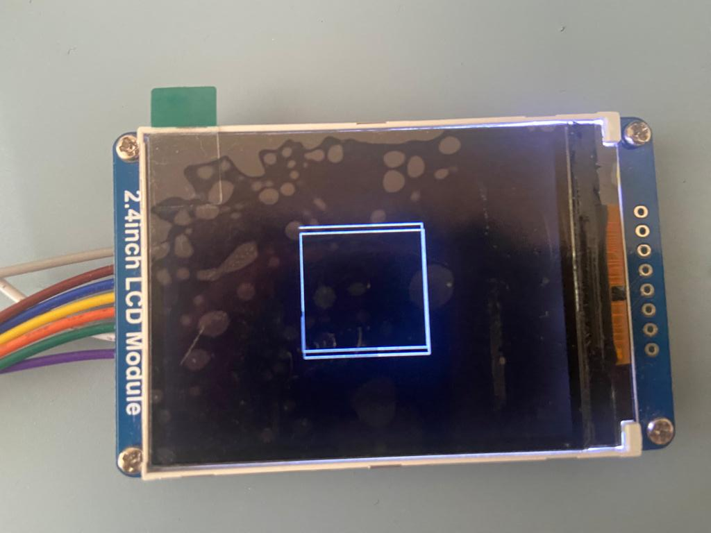
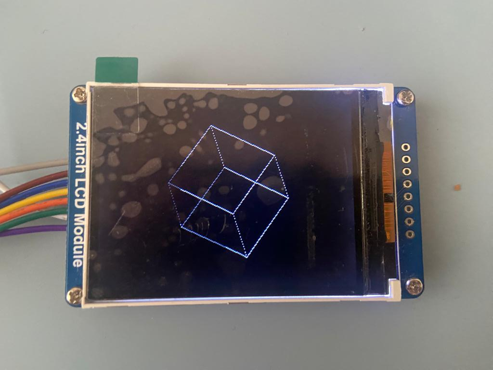
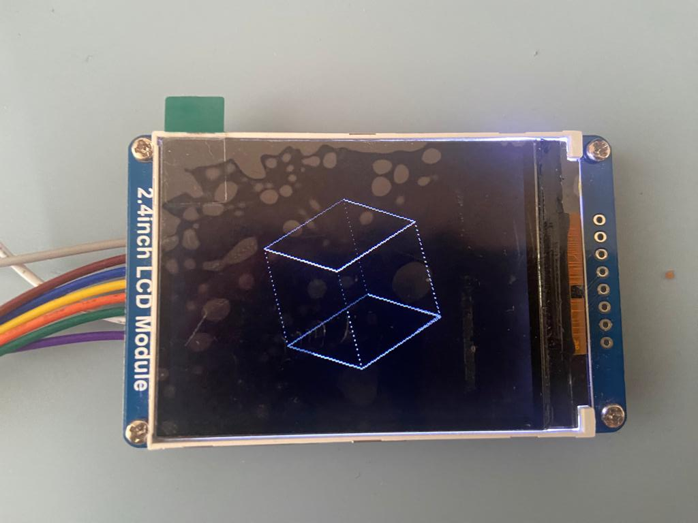
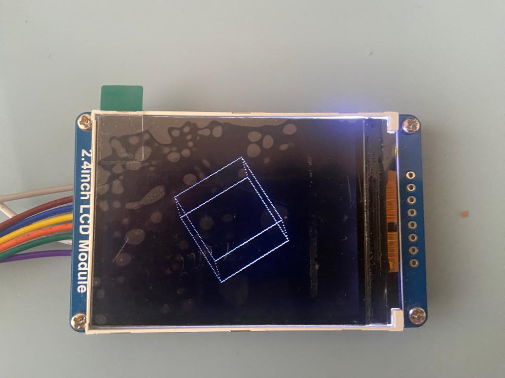

# STM32_cube_render

Program displaying rotating 3D cube on STM32F407G-DISC1 and ILI9341 controller with connected 240x320 screen via SPI. Program was written in STM32CubeIDE.

Rotated cube is displayed using roation matrices and calculating equation of a line passing through two points.

Used library: https://github.com/afiskon/stm32-ili9341

